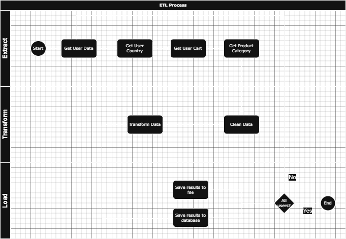

# Simple ETL

## Project Overview

The **Simple ETL (Extract, Transform, Load)** project demonstrates a straightforward implementation of an ETL pipeline using the [DummyJSON API](https://dummyjson.com/). The project aims to extract user data, transform it with additional information, and load the processed results into a file and a database.

## Key Steps:

### 1. Extraction
- Fetch user data from the DummyJSON API using pagination.
- Retrieve specific fields, including `first_name`, `last_name`, other relevant entries, and geographic coordinates (latitude and longitude).

### 2. Transformation
- Use geographic coordinates to determine each user's country name.
- Identify the most frequently added product category to each user's basket.

### 3. Loading
- Save the transformed data to a CSV file.
- Insert the data into an SQLite database.

This project highlights fundamental ETL techniques, including working with APIs, data enrichment, and database handling, providing a foundation for more complex data engineering tasks.


## Project Structure
```plaintext
simple_etl/
│
├── config/
│   ├── config.py
│   └── logging.conf
│
├── data/
│   ├── database/
│   │   └── shop.db
│   └── files/
│       └── users.csv
│
├── docs/
│   ├── flowchart.drawio
│   └── flowchart.jpg
│
├── logs/
│   └── app.log
│
├── src/
│   ├── __init__.py
│   ├── extract.py
│   ├── load.py
│   └── transform.py
│
├── tests/              
│   ├── __init__.py       
│   └── test_extract.py
│
├── main.py
├── pyproject.toml
├── README.md
└── requirements.txt
```
## ETL Process

